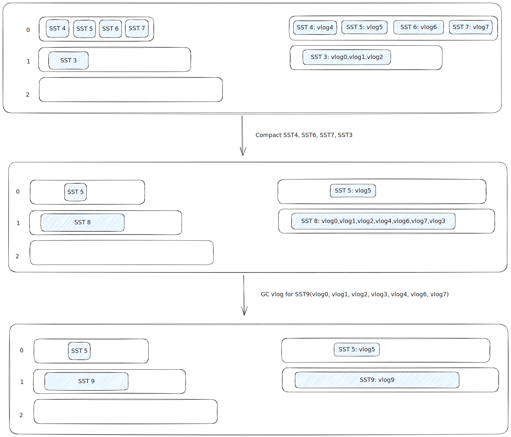

A KV storage based on LSM-Tree
- MemTable based on skiplist
- SSTable that separating keys from values
- Compaction
- GC on vlogs by group


There is still some work to do...

### Data Format

#### MemTable Format

```
       +-----------------------+    
key    |  key_size | key | tag |
       +-----------------------+

       +--------------------+
value  | value_size | value |
       +--------------------+
```

#### WAL Format
```
+---------------------------------------------------+
| checksum | key len | value len | type | key:value |
+---------------------------------------------------+
```


#### SSTable Format

```
[data block 1]
[data block 2]
...
[data block N]
[filter block]
[index block] (index + index len)
[footer] (checksum, size)
```


##### Data Block Format

```
+------------------------------------------------------------+
|  data | entryOffsets | entryOff len | checksum | check len |
+------------------------------------------------------------+
```
- data: KV pairs
- entryOffsets: Offset array for the kv data. We can use an offset to find a KV pair. By store these offsets, we can use binary search to find a key

data format
```
+-------------------------------------------+
| header | diff key | seq | val_len | value |
+-------------------------------------------+

header
+-----------------------+
| shared_len | diff_len |
+-----------------------+
```

#### MANIFEST Format
```
+-----------------------+
| log | log | ... | log |
+-----------------------+

log
+----------------------------------------------+
| BEGIN | change | change | ... | chagne | END |
+----------------------------------------------+

change
+----------------------------------------------------------------------+
| op | level | smallest len | smallest key | largest len | largest key |
+----------------------------------------------------------------------+
```
- BEGIN: Magic number, Identify the begin of a log
- END: Magic number, Identify the end of a log
- op: Operation, add or delete
- level: Which level the SSTable at
- file meta: Used for metadata
  - id: Which SSTable does we operation
  - smallest key: Smallest key in SSTable
  - largest key: Largest key in SSTable

### Compaction

For Minor Compaction(Immutable MemTable to SSTable), we can push the SSTable to high level k when:
- Level 0...k don't overlapped with the SSTable
- Level k is less than the kMaxMemCompactLevel(avoid push too high)

For Major Compaction, we select a SSTable at $level_{i}$ to compact with all SSTables in $level_{i+1}$ that overlaps with the SSTable

### GC

We separating keys from values only when key's size is more than threshold and we separating them at the time writing Immutable MemTable to SSTable. Because we think values should be sorted by keys. We also group vlogs by SSTable, that is all vlogs in a group only have values for the specific SSTable . When compaction occurs, vlogs moves with SSTables.

eg. we compact SSTable4, SSTable6, SSTable7 in level 0 with SSTable 3 in leve1, and generate a new SSTable 8. Then all vlogs that belongs to SSTable 4, 6, 7, 8, 3 will move to new SSTable 8. When it is time to GC, we merge all vlogs in SSTable 8 to one vlog. You can see figure below.



reference
- [LevelDB](https://github.com/google/leveldb)
- [WiscKey](https://www.usenix.org/conference/fast16/technical-sessions/presentation/lu)
